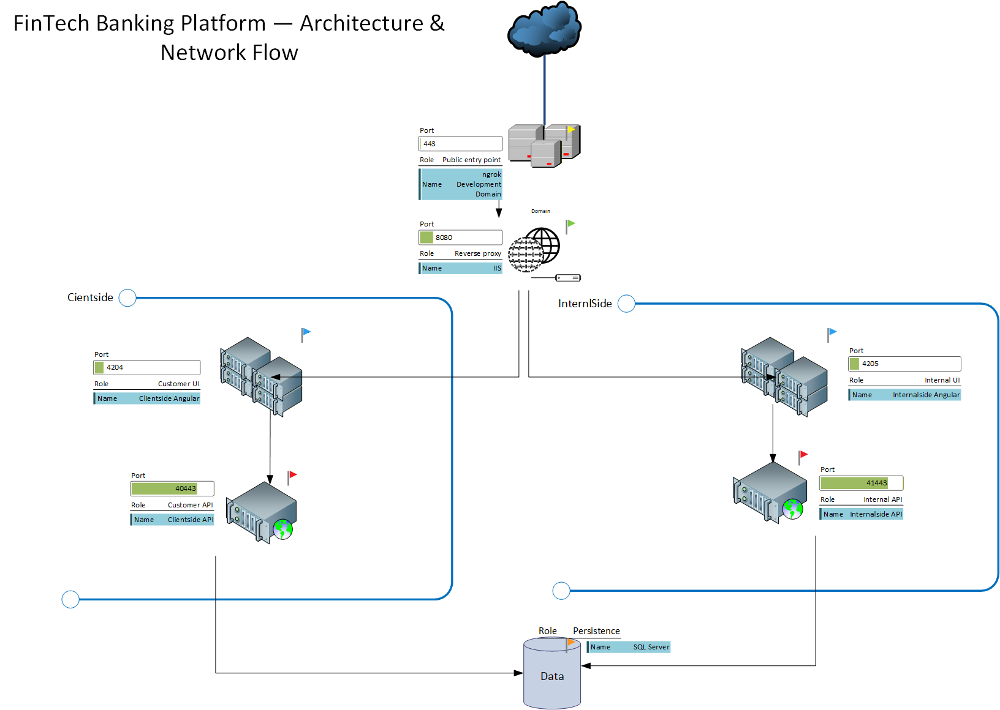

# FinTech Banking Platform — ngrok + IIS Development Architecture

## Overview

Recently, I completed work on a FinTech project where, during the development/demo environment setup, I needed to expose multiple separate applications and API services to the internet using the ngrok Free plan.

The solution uses **IIS as a shared reverse proxy**, while exposing only a single **ngrok Development Domain** address to the internet.

The setup contains two completely separate applications:

* **Clientside** — Angular `:4204` → C# API `:40443`
* **Internalside** — Angular `:4205` → C# API `:41443`

IIS separates incoming requests based on paths and forwards them to the corresponding Angular application. The applications then communicate with their respective C# APIs, while the APIs communicate with the database.

This allows a single ngrok Development Domain to serve as the public entry point for multiple separate applications and their API services, while their local applications and ports remain completely separated.

---

## Architecture & Network Flow



The overall request flow is:

```text
Internet
   ↓
ngrok Development Domain
   ↓
IIS Reverse Proxy
   ├── /clientside    → Angular :4204 → C# API :40443
   └── /internalside  → Angular :4205 → C# API :41443
                                      ↓
                                  SQL Server
```

The ngrok endpoint forwards traffic to IIS, which acts as the central entry point and performs path-based routing between the two applications.

---

## Applications

### Clientside

The Clientside application provides customer-facing banking functionality.

```text
Angular :4204
     ↓
C# API :40443
     ↓
SQL Server
```

### Internalside

The Internalside application provides functionality intended for internal bank users.

```text
Angular :4205
     ↓
C# API :41443
     ↓
SQL Server
```

Both applications remain separated at the application and local port level while sharing the IIS reverse proxy and database infrastructure.

---

## Screenshots

### Clientside


### Internalside


---

## Key Points

* Single ngrok Development Domain as the public entry point
* IIS used as a shared reverse proxy
* Path-based routing for multiple applications
* Two independent Angular applications
* Separate C# API services
* Local application ports remain isolated
* Shared SQL Server persistence
* Development/demo environment without exposing multiple public endpoints

## Technologies

* Angular
* C#
* .NET
* IIS
* ngrok
* SQL Server
